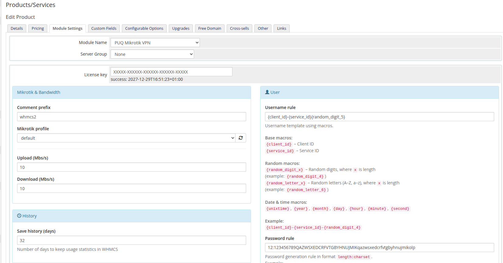
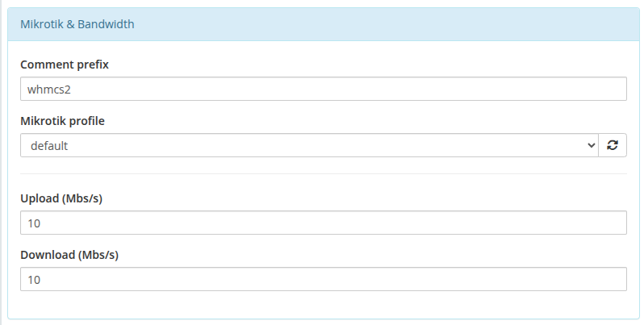
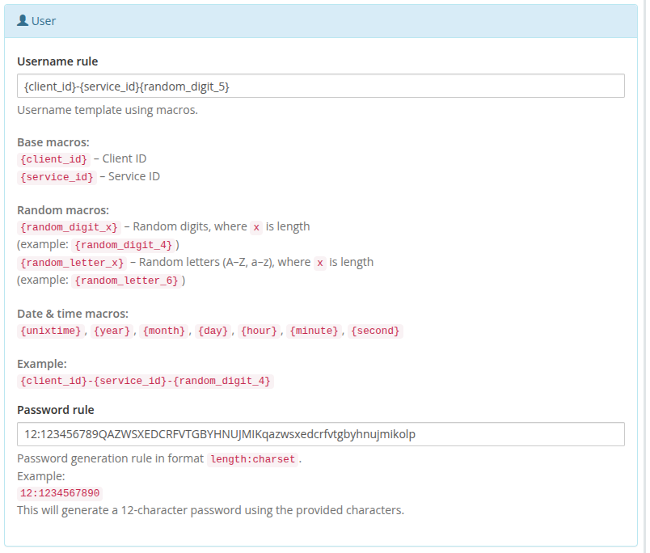
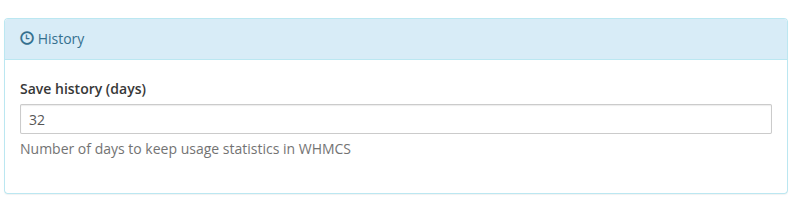
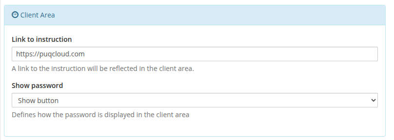
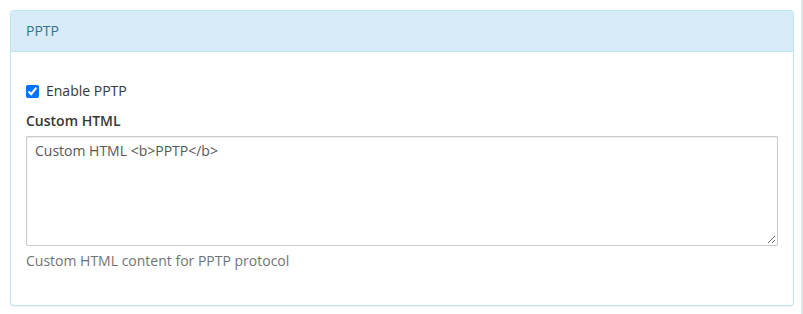
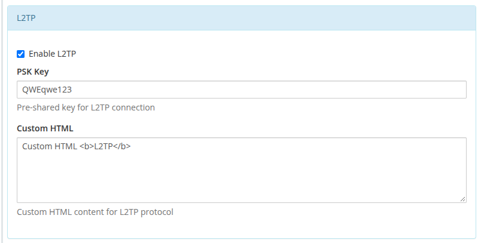
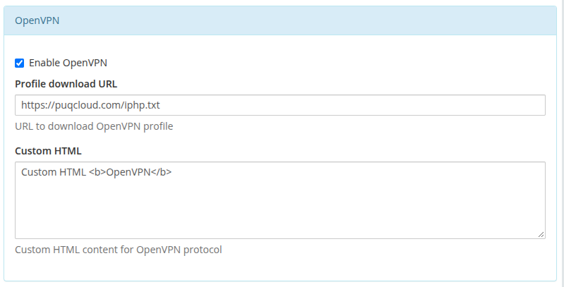
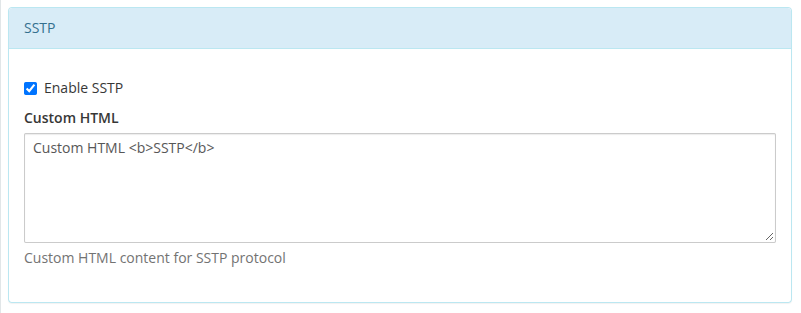

# Product Configuration

### Mikrotik VPN module **[WHMCS](https://puqcloud.com/link.php?id=77)**
#####  [Order now](https://puqcloud.com/whmcs-module-mikrotik-vpn.php) | [Download](https://download.puqcloud.com/WHMCS/servers/PUQ_WHMCS-Mikrotik-VPN/) | [Community](https://community.puqcloud.com/)

## Add new product to WHMCS

Navigate to **System Settings** → **Products/Services** → **Create a New Product**

Select the **PUQ Mikrotik VPN** module in the Module settings section.

---

## Configuration parameters

The module settings are divided into several logical blocks.

### 1. Mikrotik & Bandwidth
| Parameter | Description |
|-----------|-------------|
| **Comment prefix** | Prefix applied to the VPN user comments on the Mikrotik router (e.g. `whmcs2`). Helps identify which PPP secrets belong to WHMCS-managed accounts. |
| **Mikrotik profile** | PPP secret profile on the Mikrotik router. The dropdown is populated with the profiles configured on the selected server. |
| **Upload (Mbs/s)** | Upload speed limit applied to the VPN account. |
| **Download (Mbs/s)** | Download speed limit applied to the VPN account. |

*product-configuration-overview.png*

---

### 2. User Credentials Generation
| Parameter | Description |
|-----------|-------------|
| **Username rule** | Template for generating unique VPN usernames. You can use macros like `{client_id}`, `{service_id}`, `{random_digit_5}`, `{year}`, etc. |
| **Password rule** | Defines the format for auto-generating VPN passwords. Format: `length:charset` (e.g. `12:123456789QAZWSXEDCRFVTGBYHNUJMIKqazwsxedcrfvtgbyhnujmikolp`). |

---

### 3. History
| Parameter | Description |
|-----------|-------------|
| **Save history (days)** | Number of days to keep daily usage statistics in the WHMCS database. |

---

### 4. Client Area Settings
| Parameter | Description |
|-----------|-------------|
| **Link to instruction** | A URL to a setup manual. This link will be displayed as a button in the client area. |
| **Show password** | Defines how the password is displayed in the client area (e.g., as a toggleable button). |

*product-configuration-client-area.png*

---

### 5. VPN Protocols (PPTP, L2TP, OpenVPN, SSTP)
You can selectively enable and configure which VPN protocols are available to the client.

| Parameter | Description |
|-----------|-------------|
| **Enable [Protocol]** | Toggles the display of connection details for the specific protocol in the client area. |
| **Custom HTML** | Allows injecting custom HTML instructions specifically for this protocol block in the client area. |
| **L2TP IPSEC PSK KEY** | *(L2TP only)* The pre-shared key for IPSec. |
| **Profile download URL** | *(OpenVPN only)* A direct link to download the `.ovpn` configuration profile. |

*product-configuration-pptp.png*

*product-configuration-l2tp.png*

*product-configuration-openvpn.png*

*product-configuration-sstp.png*

---

## Metric Billing Configuration

The PUQ Mikrotik VPN module supports WHMCS **Metric Billing**, allowing you to charge clients post-paid based on their actual traffic usage.

1. Navigate to the **Metric Billing** section in your product settings.
2. Toggle the switches to **ON** for **Bandwidth Usage Download (GB)** and **Bandwidth Usage Upload (GB)**.
3. Click **Configure Pricing** to set your rates per GB across your supported currencies.

*product-configuration-metric-billing.png*

*metric-billing-download.png*

*metric-billing-upload.png*

> **Important Note on Mikrotik Bandwidth:** The module intentionally registers opposite upload/download values on the Mikrotik router compared to WHMCS, because Mikrotik measures incoming traffic while VPN clients experience outgoing traffic.
