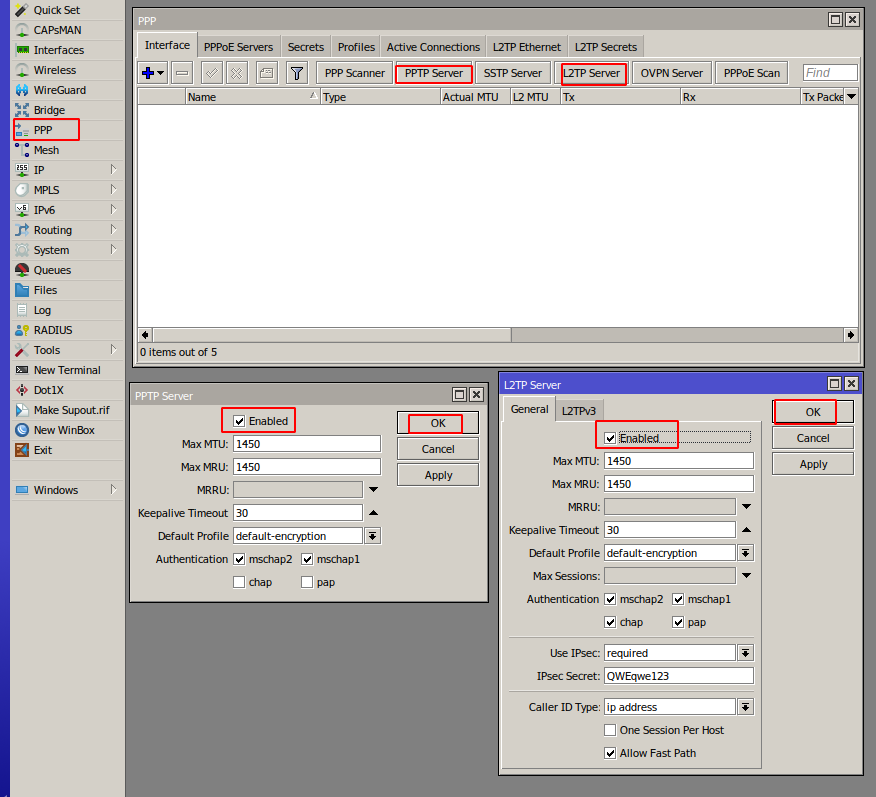

# Setup guide: Mikrotik preparation and configuration

### Mikrotik VPN module **[WHMCS](https://puqcloud.com/link.php?id=77)**
#####  [Order now](https://panel.puqcloud.com/index.php?rp=/store/whmcs-module-mikrotik-vpn) | [Download](https://download.puqcloud.com/WHMCS/servers/PUQ_WHMCS-Mikrotik-VPN/) | [FAQ](https://faq.puqcloud.com/)

This guide covers the preparation of a Mikrotik router for use with the PUQ Mikrotik VPN WHMCS module: root CA certificate, Webfig certificate, HTTPS, API-SSL and VPN server activation.

> **Note:** Enter the following commands one by one and wait for each command to complete before running the next.

---

## 1. Check RouterOS version

Ensure RouterOS version is 7.x or higher:

```
system/package/print
```

---

## 2. Create a root CA on the router

Enable HTTPS by creating your own local root Certificate Authority:

```
/certificate
add name=LocalCA common-name=LocalCA key-usage=key-cert-sign,crl-sign
```

---

## 3. Sign the root CA certificate

```
/certificate
sign LocalCA
```

---

## 4. Create a non-root certificate for Webfig

> Replace `XXX.XXX.XXX.XXX` with your router's public IP address (or the hostname you use to reach it).

```
/certificate
add name=Webfig common-name=XXX.XXX.XXX.XXX
```

---

## 5. Sign the Webfig certificate with the local CA

```
/certificate
sign Webfig ca=LocalCA
```

---

## 6. Enable HTTPS (www-ssl) with the Webfig certificate

```
/ip service
set www-ssl certificate=Webfig disabled=no
```

---

## 7. Enable API-SSL with the Webfig certificate

The PUQ Mikrotik VPN module communicates with the router through the **API-SSL** service:

```
/ip service
set api-ssl certificate=Webfig disabled=no
```

> **Important:** The module uses the Mikrotik API only. Make sure the API-SSL port is reachable from the WHMCS server.

---

## 8. Enable VPN server

Enable the VPN protocol(s) you plan to offer to clients (PPTP, L2TP, etc.) and configure the corresponding PPP profile, service and IP pool. The PPP profile name configured here will later be selected in the product settings on the WHMCS side.


*16-mikrotik-setup.png*

---

## 9. Firewall, NAT and routing

Configure NAT, firewall and routing on the Mikrotik router so that VPN clients can reach the Internet and any internal resources you want to expose. The module itself only provisions the user account (PPP secret) — the surrounding network configuration is the responsibility of the router administrator.

> **Important:** The module registers opposite values for upload and download speeds in the Mikrotik router compared to the WHMCS product settings, because Mikrotik measures incoming traffic while VPN clients experience outgoing traffic.
