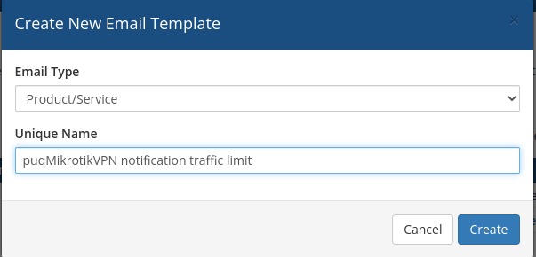
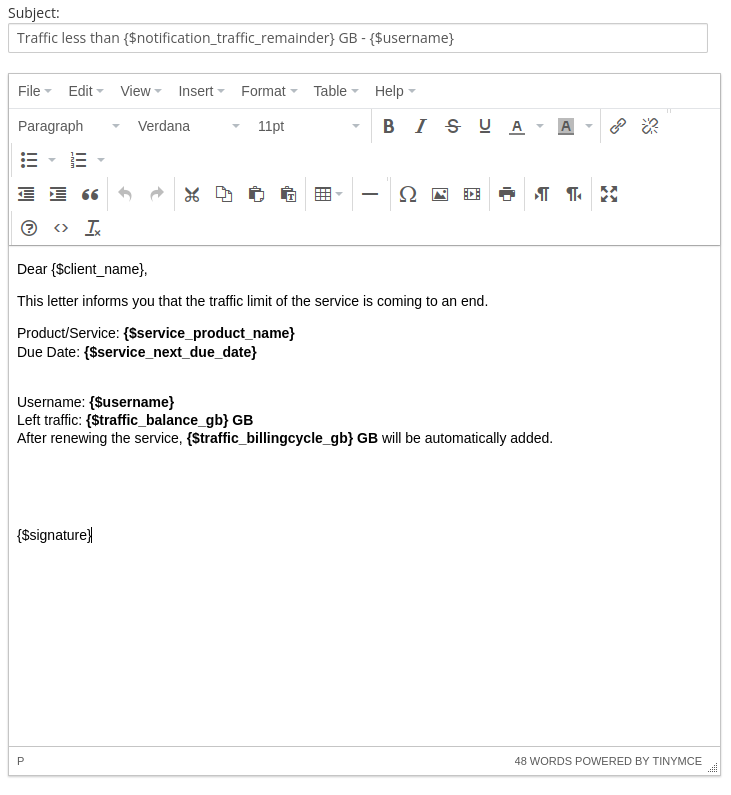

# Email Template (puqMikrotikVPN notification traffic limit)

### Mikrotik VPN module **[WHMCS](https://puqcloud.com/link.php?id=77)**
#####  [Order now](https://panel.puqcloud.com/index.php?rp=/store/whmcs-module-mikrotik-vpn) | [Download](https://download.puqcloud.com/WHMCS/servers/PUQ_WHMCS-Mikrotik-VPN/) | [FAQ](https://faq.puqcloud.com/)

## Creating the email template

Navigate to **System Settings** → **Email Templates** → **Create New Email Template**

This template is used to notify the customer when the remaining traffic falls below the threshold configured in the product settings ("Notification traffic remainder less than X GB").

---

## Template configuration

| Parameter | Value |
|-----------|-------|
| **Email Type** | Product/service |
| **Unique Name** | puqMikrotikVPN notification traffic limit |

---

## Email subject

```
Traffic less than {$notification_traffic_remainder} GB - {$username}
```

---

## Email body

```
Dear {$client_name},

This letter informs you that the traffic limit of the service is coming to an end.

Product/Service: {$service_product_name}
Due Date: {$service_next_due_date}

Username: {$username}
Left traffic: {$traffic_balance_gb} GB
After renewing the service, {$traffic_billingcycle_gb} GB will be automatically added.

{$signature}
```

---

## Available template variables

The following custom variables are passed to the email template by the module:

| Variable | Description | Example |
|----------|-------------|---------|
| `{$username}` | VPN account username | mikrotik-user-42 |
| `{$notification_traffic_remainder}` | Traffic threshold configured in product settings (GB) | 5 |
| `{$traffic_balance_gb}` | Remaining traffic balance for the customer (GB) | 4.2 |
| `{$traffic_billingcycle_gb}` | Traffic that will be added on the next billing cycle (GB) | 100 |

In addition, all standard WHMCS product/service merge fields are available (e.g. `{$client_name}`, `{$service_product_name}`, `{$service_next_due_date}`, `{$signature}`).

> **Note:** Notifications are sent automatically during the WHMCS cron execution when remaining traffic falls below the threshold configured in the product settings.

---

## Screenshots


*07-email-template-1.png*


*08-email-template-2.png*
