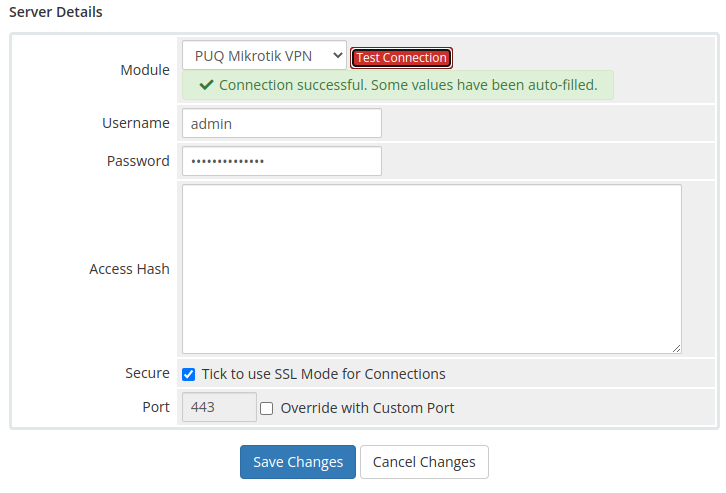

# Add server (Mikrotik router)

### Mikrotik VPN module **[WHMCS](https://puqcloud.com/link.php?id=77)**
#####  [Order now](https://panel.puqcloud.com/index.php?rp=/store/whmcs-module-mikrotik-vpn) | [Download](https://download.puqcloud.com/WHMCS/servers/PUQ_WHMCS-Mikrotik-VPN/) | [FAQ](https://faq.puqcloud.com/)

## Adding a Mikrotik router to WHMCS

Configure a Mikrotik router as a server within WHMCS using the PUQ Mikrotik VPN module.

Navigate to **System Settings** → **Servers** → **Add New Server**

---

### Step 1: General settings

Enter the correct **Name** and **Hostname** for your Mikrotik router.

- **Name** — an internal identification for the server (e.g. "My great Mikrotik router")
- **Hostname** — a resolvable domain pointing to the router's IP address (e.g. `vpn.mydomain.com`)

If your Mikrotik API-SSL service listens on a non-standard port, enter it in the **Port** field. Check the **Secure** checkbox (the module talks to the router through API-SSL).

*04-add-server-1.png*

---

### Step 2: Assigned IP addresses

In the **Assigned IP Addresses** field, enter the list of IP addresses that will be distributed to users. These IPs are consumed sequentially as new VPN accounts are provisioned. Both private and public IP addresses are supported.

---

### Step 3: Module settings

1. In the Server Details section, select the **PUQ Mikrotik VPN** module from the dropdown
2. Enter valid Mikrotik router credentials:
   - **Username** — Mikrotik user with API access (typically with the `full` group or custom group that includes `api`, `write`, `read`, `policy`)
   - **Password** — the corresponding password
3. Click **Test connection** to verify the connection is working correctly

The test connection verifies that the module can reach the Mikrotik API-SSL service and authenticate with the provided credentials.

*05-add-server-2.png*

> **Important:** The Mikrotik user must have sufficient privileges to create and manage PPP secrets, read traffic counters and reset them. The module uses the Mikrotik API only — SSH access is not used.
