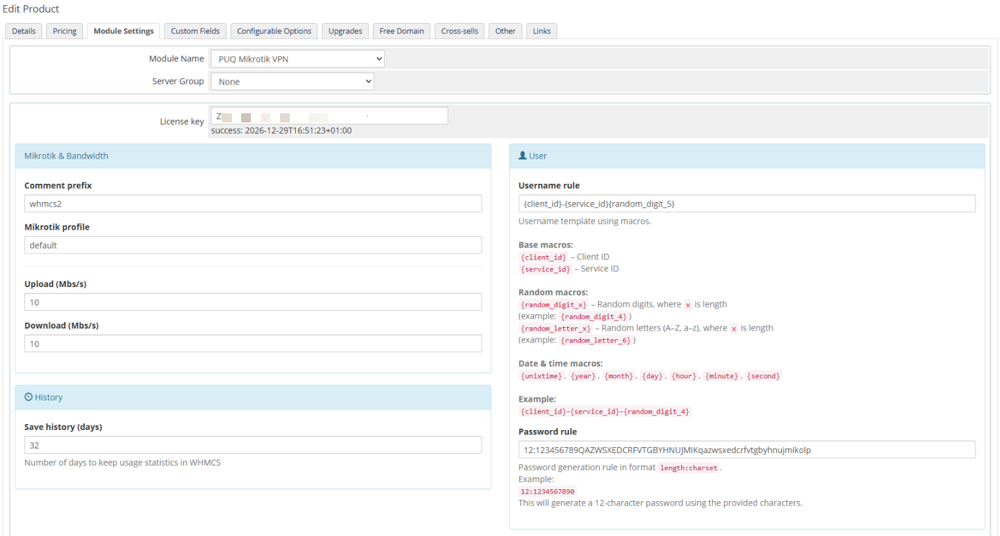
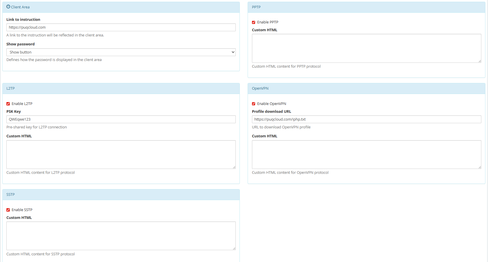

# Product Configuration

### Mikrotik VPN module **[WHMCS](https://puqcloud.com/link.php?id=77)**
#####  [Order now](https://panel.puqcloud.com/index.php?rp=/store/whmcs-module-mikrotik-vpn) | [Download](https://download.puqcloud.com/WHMCS/servers/PUQ_WHMCS-Mikrotik-VPN/) | [FAQ](https://faq.puqcloud.com/)

## Add new product to WHMCS

Navigate to **System Settings** → **Products/Services** → **Create a New Product**

Select the **PUQ Mikrotik VPN** module in the Module settings section.

---

## Configuration parameters

| Parameter | Description |
|-----------|-------------|
| **License key** | A pre-purchased license key for the PUQ Mikrotik VPN module. The license must be active for correct operation. After saving, the verification status is displayed below the field. |
| **Comment PREFIX** | Prefix applied to the VPN user comments on the Mikrotik router. Helps identify which PPP secrets belong to WHMCS-managed accounts. |
| **Profile** | PPP secret profile on the Mikrotik router. The dropdown is populated with the profiles configured on the selected server. |
| **Service** | Available VPN service on the Mikrotik router (e.g. `any`, `pptp`, `l2tp`, `pppoe`, etc.). |
| **Bandwidth Download** | Download speed limit in M/s applied to the VPN account. |
| **Bandwidth Upload** | Upload speed limit in M/s applied to the VPN account. |
| **Traffic (One Time / Monthly / Quarterly / Semi-Annual / Annual / Biennial / Triennial)** | Packet of traffic added per billing cycle (in GB). Values match the WHMCS billing cycle of the product. |
| **Save traffic history (days)** | Number of days to retain daily traffic usage statistics. Older records are deleted automatically during cron execution. |
| **User notification traffic limit email template** | Email template sent when remaining traffic falls below the threshold configured in the next field. Select a Product/service email template (created manually in WHMCS). |
| **Notification traffic remainder less than X GB** | Traffic threshold (in GB) that triggers the notification email. |
| **Suspend exceeding traffic limit email template** | Email template sent when the traffic balance reaches zero or below and the VPN account is automatically suspended on the router. |
| **Link to instruction** | Optional URL to a client-facing setup manual. Displayed as a button in the client area. Leave empty to hide the button. |
| **Support PPtP** | Toggles the display of PPtP connection details (server address, credentials) in the client area. |
| **Support L2TP** | Toggles the display of L2TP connection details in the client area. |
| **L2TP IPSec PSK key** | The IPSec pre-shared key for L2TP; displayed in the client area when L2TP support is enabled. |
| **Statistics collection frequency** | The frequency at which traffic usage statistics are collected by the WHMCS cron. Also checks the traffic balance and disables the VPN account on the Mikrotik router when the balance is exhausted. |

---

## Important notes

> **Warning:** This module works only as a **server module** (Products/Services). It cannot be used as an add-on product. Attempting to use it with add-on products will result in an error message.

> **Post-paid traffic billing (v3.0+):** The module no longer exposes its own traffic package selector. Traffic consumption is reported back to WHMCS using standard metrics, so you can build any post-paid traffic pricing model directly in the WHMCS product configuration.

> **Opposite upload/download values on Mikrotik:** the module intentionally registers opposite values on the router compared to the WHMCS settings, because Mikrotik measures incoming traffic while VPN clients experience outgoing traffic.

---

## Screenshots

*09-product-configuration.png*

*17-product-configuration-2.png*
