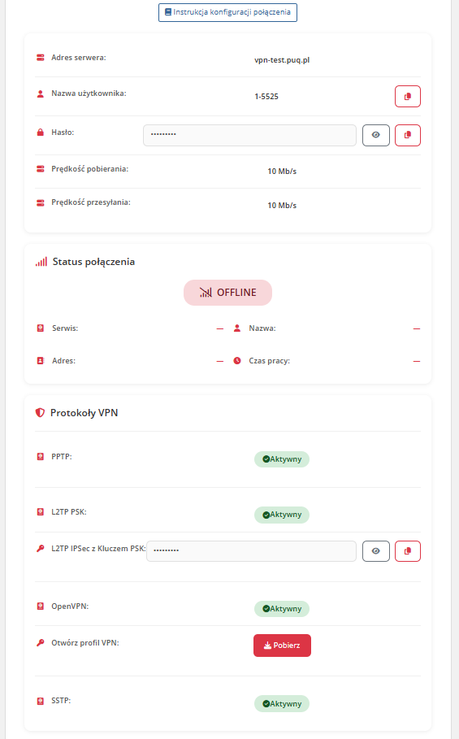

# Home screen

### Mikrotik VPN module **[WHMCS](https://puqcloud.com/link.php?id=77)**
#####  [Order now](https://panel.puqcloud.com/index.php?rp=/store/whmcs-module-mikrotik-vpn) | [Download](https://download.puqcloud.com/WHMCS/servers/PUQ_WHMCS-Mikrotik-VPN/) | [FAQ](https://faq.puqcloud.com/)

## Client area home screen

After authenticating to the client panel, the end customer sees the VPN service management page with the following sections:

### Service information

- **User manual** — a button linking to the instruction URL (displayed only if configured by the administrator in product settings, "Link to instruction" field)
- **VPN server address** — the hostname or IP address the customer should connect to
- **VPN protocols** — information about which protocols (PPtP, L2TP) are available for this product, based on the "Support PPtP" / "Support L2TP" product settings
- **L2TP IPSec PSK key** — displayed when L2TP support is enabled
- **Username** — the VPN username with a **copy-to-clipboard** button
- **Password** — the VPN password with a **copy-to-clipboard** button
- **Connection status** — real-time indicator of whether the VPN account is currently connected on the router
- **Bandwidth limit** — displays the configured download / upload speed limits

### Traffic information

- **Remaining traffic balance** — the current traffic balance for the customer
- **Traffic that will be added** on the next billing cycle

### Sidebar navigation

The client area sidebar contains two menu items:
- **Information** — the main service details page (described above)
- **Traffic statistics** — historical traffic usage charts (see [Traffic statistics](#) page)

> **Note:** If the service status is not Active or if the VPN account cannot be found on the Mikrotik router, an error page is displayed instead.

---

## Screenshot

*10-home-screen.png*
