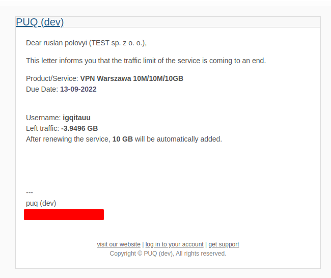
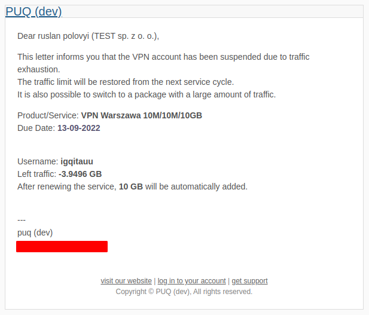

# Email notification

### Mikrotik VPN module **[WHMCS](https://puqcloud.com/link.php?id=77)**
#####  [Order now](https://panel.puqcloud.com/index.php?rp=/store/whmcs-module-mikrotik-vpn) | [Download](https://download.puqcloud.com/WHMCS/servers/PUQ_WHMCS-Mikrotik-VPN/) | [FAQ](https://faq.puqcloud.com/)

## Email notification examples

The module sends two types of automatic email notifications based on the customer's traffic balance and the templates configured in the product settings.

---

### 1. Traffic limit about to be exhausted

Sent automatically when the remaining traffic balance falls below the threshold configured in the product settings ("Notification traffic remainder less than X GB"). Uses the template selected in "User notification traffic limit email template".

*11-email-notification-1.png*

---

### 2. Suspension notification (traffic exhausted)

Sent automatically when the traffic balance reaches zero or below and the module suspends the VPN account on the Mikrotik router. Uses the template selected in "Suspend exceeding traffic limit email template".

*12-email-notification-2.png*

> **Note:** Both templates must be created manually in WHMCS before they can be selected in the product settings. See the [Email Template](#) pages in the Installation and Configuration chapter.
