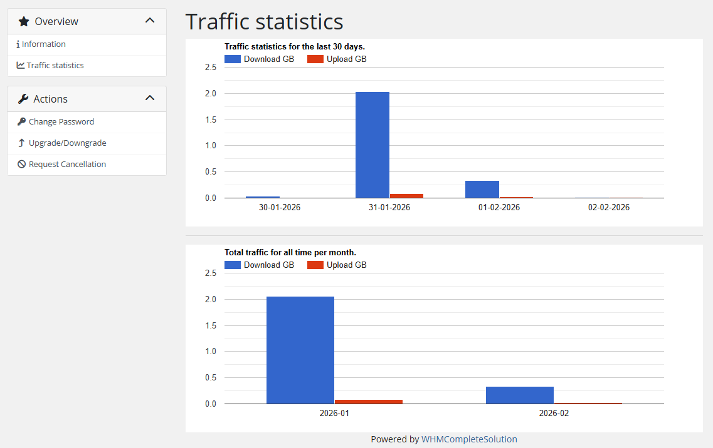

# Traffic statistics

### Mikrotik VPN module **[WHMCS](https://puqcloud.com/link.php?id=77)**
#####  [Order now](https://panel.puqcloud.com/index.php?rp=/store/whmcs-module-mikrotik-vpn) | [Download](https://download.puqcloud.com/WHMCS/servers/PUQ_WHMCS-Mikrotik-VPN/) | [FAQ](https://faq.puqcloud.com/)

## Traffic usage statistics

The client can view traffic usage statistics in the sidebar menu item **"Traffic statistics"**.

The statistics page shows the customer's traffic on a **daily basis**, broken down into **incoming** and **outgoing** traffic. Both charts are powered by Google Charts and automatically resize to fit the browser window. The raw data is collected by the WHMCS cron job and stored in the database for the number of days configured in the product settings ("Save traffic history (days)" parameter).

> **Note:** Statistics data is only available after the WHMCS cron has run at least once with the UsageUpdate function. After each collection, traffic counters on the Mikrotik router are reset to zero to guarantee accurate accounting for the next interval.

---

## Screenshots

*13-traffic-statistics-1.png*

*14-traffic-statistics-2.png*
