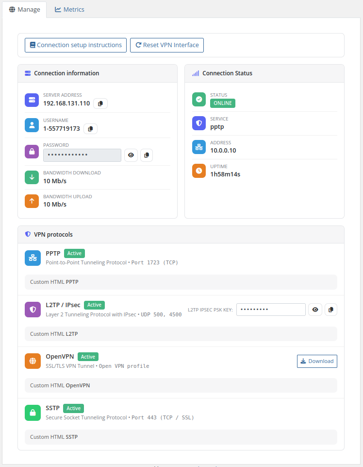
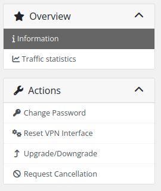

# Client Area Home Screen

### Mikrotik VPN module **[WHMCS](https://puqcloud.com/link.php?id=77)**
#####  [Order now](https://puqcloud.com/whmcs-module-mikrotik-vpn.php) | [Download](https://download.puqcloud.com/WHMCS/servers/PUQ_WHMCS-Mikrotik-VPN/) | [Community](https://community.puqcloud.com/)

## VPN Service Management Dashboard

After authenticating in the client area, the end customer sees the VPN service management page under the **Manage** tab. 

### Quick Actions
At the top of the dashboard, clients can find:
- **Connection setup instructions** — links to your predefined documentation (if configured).
- **Reset VPN Interface** — allows the client to manually reset their active VPN session.

### Connection Information Card
Displays all the primary details needed to establish the connection:
- **Server Address** — IP address or hostname of the Mikrotik router.
- **Username** — VPN username (auto-generated or assigned).
- **Password** — masked password with an option to toggle visibility.
- **Bandwidth Limits** — the configured upload/download speeds for the account (e.g. `10 Mb/s`).
*(Includes quick-copy icons next to sensitive values).*

### Connection Status Card
Provides real-time information by querying the router API:
- **Status** — `ONLINE` or `OFFLINE` badge.
- **Active Service** — which protocol is currently in use (e.g. `pptp`).
- **Client IP Address** — the internal VPN IP address assigned.
- **Session Uptime** — duration of the current connection.

### VPN Protocols Section
Displays the specific connection details for each VPN protocol enabled by the administrator (PPTP, L2TP, OpenVPN, SSTP). Each section contains:
- Connection port and security details.
- Custom HTML blocks with specific instructions if injected by the admin.
- Dedicated download buttons (e.g., OpenVPN profile configuration file).
- Specialized keys (e.g., `L2TP IPSEC PSK KEY`).

---

## Screenshot

*client-area-home.png*

*client-area-sidebar.png*
