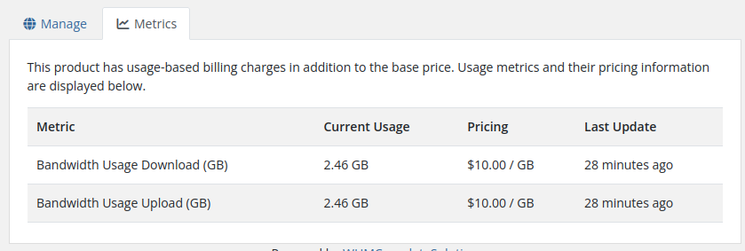

# Usage Metrics

### Mikrotik VPN module **[WHMCS](https://puqcloud.com/link.php?id=77)**
#####  [Order now](https://puqcloud.com/whmcs-module-mikrotik-vpn.php) | [Download](https://download.puqcloud.com/WHMCS/servers/PUQ_WHMCS-Mikrotik-VPN/) | [Community](https://community.puqcloud.com/)

## Usage-Based Billing Metrics

When WHMCS Metric Billing is enabled for the product, clients can track their current traffic consumption and billing rates under the **Metrics** tab on their service management page.

### Metrics Tab Overview

The tab presents:
- **Bandwidth Usage Download (GB)** — cumulative downloaded data counted towards usage-based billing.
- **Bandwidth Usage Upload (GB)** — cumulative uploaded data counted towards usage-based billing.
- **Pricing** — unit price charged per gigabyte (e.g. `$10.00 / GB`).
- **Last Update** — relative time when metrics were last synchronized from the Mikrotik router by the WHMCS cron job.

---

## Screenshot

*client-area-metrics.png*
