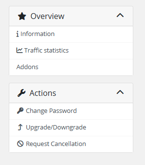
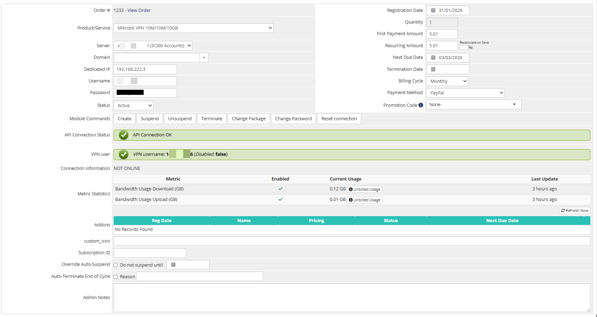

# Description

### Mikrotik VPN module **[WHMCS](https://puqcloud.com/link.php?id=77)**
#####  [Order now](https://panel.puqcloud.com/index.php?rp=/store/whmcs-module-mikrotik-vpn) | [Download](https://download.puqcloud.com/WHMCS/servers/PUQ_WHMCS-Mikrotik-VPN/) | [FAQ](https://faq.puqcloud.com/)

## Mikrotik VPN WHMCS module

The Mikrotik VPN WHMCS module is a provisioning module that integrates WHMCS with Mikrotik routers, enabling Internet and VPN service providers to offer VPN accounts to their customers. The module automates the full lifecycle of VPN account management using the Mikrotik API only.

---

## Main features

- **Automatic account provisioning** — auto create and deploy client VPN accounts on the Mikrotik router upon order activation
- **Account lifecycle management** — create, suspend, unsuspend, terminate, change package, change password and reset connection for VPN accounts
- **Bandwidth control** — configurable download / upload speed limits (M/s) enforced by the Mikrotik PPP profile
- **Traffic limits & post-paid billing** — configurable traffic quotas per billing cycle (One Time, Monthly, Quarterly, Semi-Annual, Annual, Biennial, Triennial) with post-paid traffic billing via standard WHMCS metrics
- **Traffic usage statistics** — daily incoming / outgoing traffic history with configurable retention period
- **Auto-suspension on traffic exhaustion** — the VPN account is automatically disabled on the Mikrotik router when the traffic balance reaches zero
- **Email notifications** — automatic notifications when remaining traffic falls below a configurable threshold and when the account is suspended due to traffic exhaustion
- **Multi-language support** — 25+ languages including Arabic, Azerbaijani, Catalan, Chinese, Croatian, Czech, Danish, Dutch, English, Estonian, Farsi, French, German, Hebrew, Hungarian, Italian, Macedonian, Norwegian, Polish, Romanian, Russian, Spanish, Swedish, Turkish, Ukrainian
- **Client area integration** — customers can view the VPN server address, available protocols, credentials with copy-to-clipboard, connection status, bandwidth limit and traffic statistics
- **Admin area tools** — administrators can view license status, Mikrotik API connection status, product information and manage VPN accounts via standard WHMCS module buttons
- **IP address pool** — the module distributes IP addresses from the list specified in the WHMCS server settings; both private and public IPs are supported
- **Configurable protocol support** — independent toggles for PPtP and L2TP protocols, L2TP IPSec PSK key displayed in the client area
- **Instruction link** — optional URL to the VPN setup manual displayed as a button in the client area
- **License verification** — built-in license system with online / offline verification and admin alerts

---

## System requirements

| Requirement | Minimum |
|-------------|---------|
| WHMCS | 9.x or higher |
| PHP | 8.2 or higher |
| Mikrotik RouterOS | 7.x or higher |
| ionCube Loader | v13 or newer (v14, v15) |

> **Important:** The module registers opposite values for upload and download speeds in the Mikrotik router compared to WHMCS settings, because Mikrotik measures incoming traffic while VPN clients experience outgoing traffic. Proper Mikrotik router configuration is essential (NAT, firewall, routing, and all required VPN server settings).

---

## Links

- **Product page:** [https://panel.puqcloud.com/index.php?rp=/store/whmcs-module-mikrotik-vpn](https://panel.puqcloud.com/index.php?rp=/store/whmcs-module-mikrotik-vpn)
- **Documentation:** [https://doc.puq.info/books/mikrotik-vpn-whmcs-module](https://doc.puq.info/books/mikrotik-vpn-whmcs-module)
- **Support:** [https://puqcloud.com/submitticket.php](https://puqcloud.com/submitticket.php?step=2&deptid=1)
- **Community:** [https://community.puqcloud.com/](https://community.puqcloud.com/)

---

## Screenshots

### Client area — Home screen

*01-description-client-area.png*

### Client area — Traffic statistics

*02-description-traffic-stats.png*

### Admin area — Product information

*03-description-admin-area.png*
