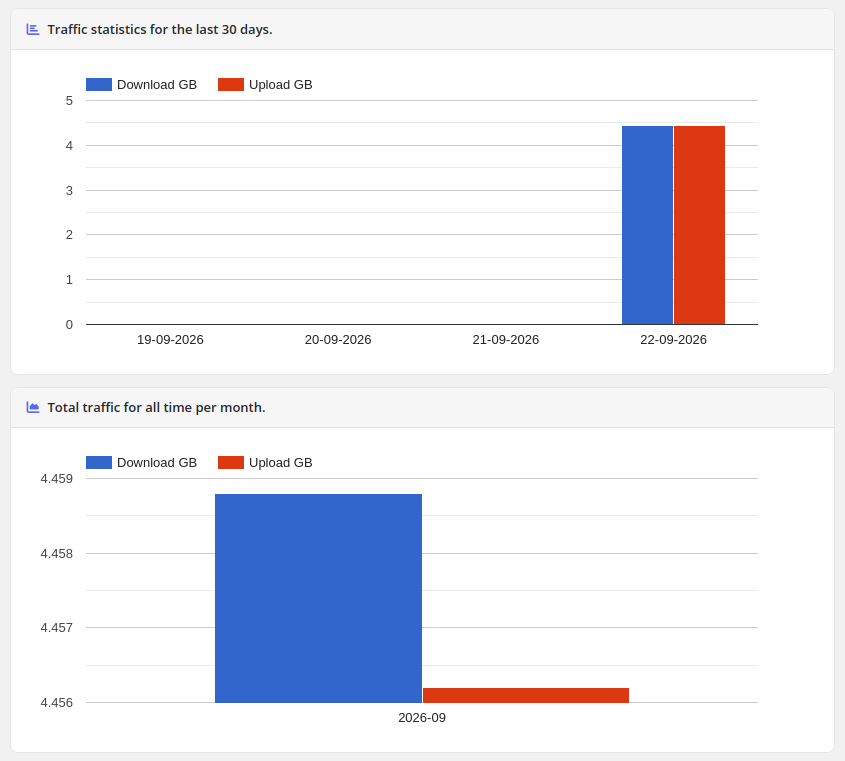
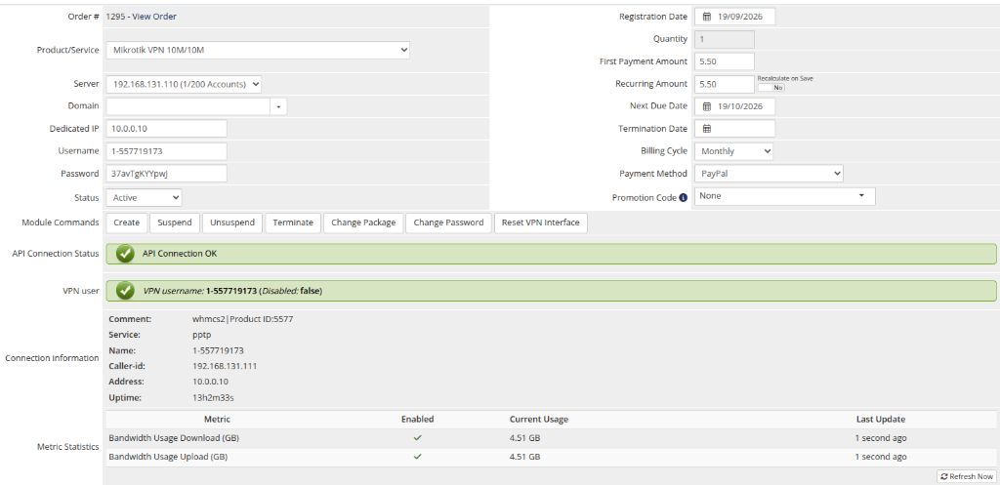

# Description

### Mikrotik VPN module **[WHMCS](https://puqcloud.com/link.php?id=77)**
#####  [Order now](https://puqcloud.com/whmcs-module-mikrotik-vpn.php) | [Download](https://download.puqcloud.com/WHMCS/servers/PUQ_WHMCS-Mikrotik-VPN/) | [Community](https://community.puqcloud.com/)

## Mikrotik VPN WHMCS module

The Mikrotik VPN WHMCS module is a provisioning module that integrates WHMCS with Mikrotik routers, enabling Internet and VPN service providers to offer VPN accounts to their customers. The module automates the full lifecycle of VPN account management using the Mikrotik API only.

---

## Main features

- **Automatic account provisioning** — auto create and deploy client VPN accounts on the Mikrotik router upon order activation
- **Account lifecycle management** — create, suspend, unsuspend, terminate, change package, change password, and reset VPN interface
- **Bandwidth control** — configurable download / upload speed limits (M/s) enforced by the Mikrotik PPP profile
- **Metric billing** — post-paid usage-based billing for incoming and outgoing traffic (GB) via standard WHMCS MetricProvider
- **Atomic traffic statistics** — daily and monthly traffic charts with Google Charts, with atomic database increments preventing race condition losses
- **Multi-language support** — 26 languages including Arabic, Azerbaijani, Catalan, Chinese, Croatian, Czech, Danish, Dutch, English, Estonian, Farsi, French, German, Hebrew, Hungarian, Italian, Macedonian, Norwegian, Polish, Romanian, Russian, Spanish, Swedish, Turkish, Ukrainian
- **Client area integration** — customers can view the VPN server address, available protocols, credentials with copy-to-clipboard, connection status, bandwidth limit and traffic statistics
- **Admin area tools** — administrators can view license status, Mikrotik API connection status (with 15s timeout protection), product information and manage VPN accounts via standard WHMCS module buttons
- **IP address pool** — the module distributes IP addresses from the list specified in the WHMCS server settings; both private and public IPs are supported
- **Configurable protocol support** — independent toggles for PPtP, L2TP (with IPSec PSK), OpenVPN, and SSTP protocols with custom instruction HTML per protocol
- **Instruction and client links** — optional URLs to VPN setup manuals and client downloads displayed as action buttons in the client area
- **License verification** — built-in license system with online / offline verification and admin alerts

---

## System requirements

| Requirement | Minimum |
|-------------|---------|
| **WHMCS** | 8.x+, 9.x+ |
| **PHP** | 7.4, 8.1, 8.2, 8.3, 8.4 |
| **Mikrotik RouterOS** | 7.x or higher |
| **ionCube Loader** | v15+ |

> **Important:** The module registers opposite values for upload and download speeds in the Mikrotik router compared to WHMCS settings, because Mikrotik measures incoming traffic while VPN clients experience outgoing traffic. Proper Mikrotik router configuration is essential (NAT, firewall, routing, and all required VPN server settings).

---

## Links

- **Product page:** [https://puqcloud.com/whmcs-module-mikrotik-vpn.php](https://puqcloud.com/whmcs-module-mikrotik-vpn.php)
- **Documentation:** [https://doc.puq.info/books/mikrotik-vpn-whmcs-module](https://doc.puq.info/books/mikrotik-vpn-whmcs-module)
- **Support:** [https://puqcloud.com/submitticket.php](https://puqcloud.com/submitticket.php?step=2&deptid=1)
- **Community:** [https://community.puqcloud.com/](https://community.puqcloud.com/)

---

## Screenshots

### Client area — Home screen

*client-area-home.png*

### Client area — Traffic statistics

*client-area-traffic.png*

### Client area — Usage metrics

*client-area-metrics.png*

### Admin area — Product information

*admin-product-info.png*
